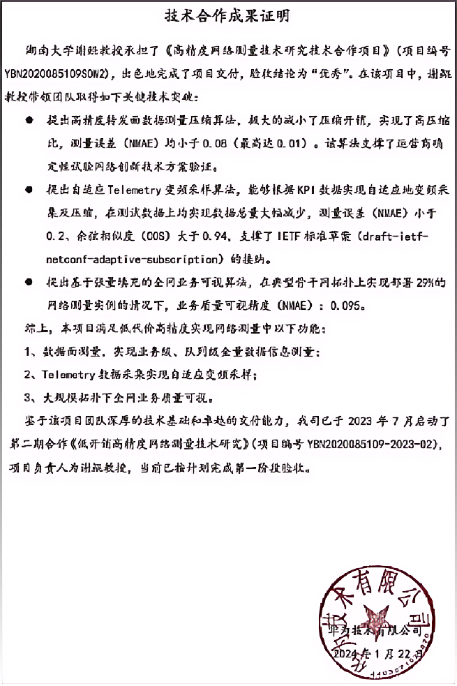

I'm a third year Ph.D student from [College of CSEE](https://csee.hnu.edu.cn/), [Hunan University](https://www.hnu.edu.cn/). My research interest includes ***AI-infra Observability***, ***Spatio-Temporal Data Management***, ***Compress Sensing***, ***Network Monitoring***, and ***Time Series Intelligence***.

I am deeply motivated to drive AI infrastructure performance improvements, extending beyond observability.

*Ongoing*: I am applying to the 2025 Tencent Rhino-Bird Infrastructure Technology Research Program with a research proposal titled:
"Evaluating Business Operational Quality via QoS Metrics in Operating Systems".

[Email](mailto:jihaojie@hnu.edu.cn) / [Github](https://github.com/haojieji)

Publications
======
1. **Haojie Ji**, Kun Xie, Jigang Wen, Qingyi Zhang, Gaogang Xie, and Wei Liang. 2024. *FineMon: An Innovative Adaptive Network Telemetry Scheme for Fine-Grained, Multi-Metric Data Monitoring with Dynamic Frequency Adjustment and Enhanced Data Recovery*. **SIGMOD** (February 2024), 26 pages. [PaperVideo](https://dl.acm.org/doi/10.1145/3639267) / [Poster & SystemDemo](https://github.com/haojieji/FineMon)
2. **Haojie Ji**. *Traceable and Robust Data Monitoring System with Low-Rank Frequency Adapter and Causal Structure Learning*. (ready to submit to VLDB 2026)

Education
======
* 2022 Ph.D. in Computer Science and Technology, CSEE, Hunan University (**GPA**: 3.73/4)
* 2020~2022 Master in Computer Science, CSEE, Hunan University (GPA: 3.27/4)
* 2016~2020 B.E. in Software Engineering, Shanxi Agricultural University (**GPA**: 4.15/5, **Rank**: 3/425)

Awards
======
1. Outstanding Graduate Student 2024, Hunan University. ([Certificates](https://csee.hnu.edu.cn/info/1062/13358.htm))
2. First Prize in the Final of the 8th Future Network Science and Technology Innovation Competition 2024, [FNII](https://www.gfnds.com/) & [PML](https://www.pmlabs.com.cn/). (**Rank**: *4/168*, **Demo**: [SystemDemo-Video](../images/demo.mp4), **Certificates**: [Certificates](https://www.gfnds.com/competition_list/125.html))
3. ACM Student Scholarship 2024, ACM.
4. Grant for Distinguished International Academic Conferences 2024, Hunan University.
5. Presidential Scholarship 2020, Shanxi Agricultural University

Huawei Projects
------
1. 2021-2022 High Precision Network Measurement Technology Research Project, Huawei Technologies Co. (**Proj-ID**:TBN2020085109S0W2, **Certificates** (The proj-leader is my advisor Prof.KunXie, i'm the main executor): )
2. 2022-2023 Research on Low Overhead High Precision Network Measurement Technology, Huawei Technologies Co. (**Proj-ID**:YBN2020085109-2023-02)

